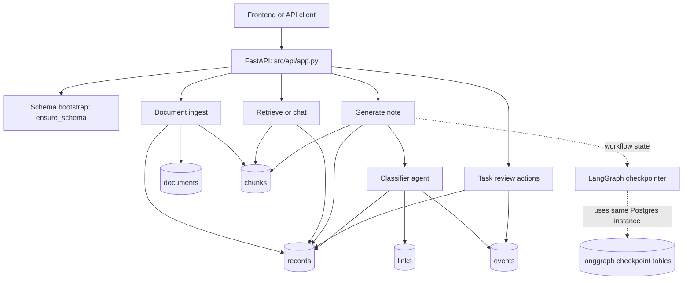
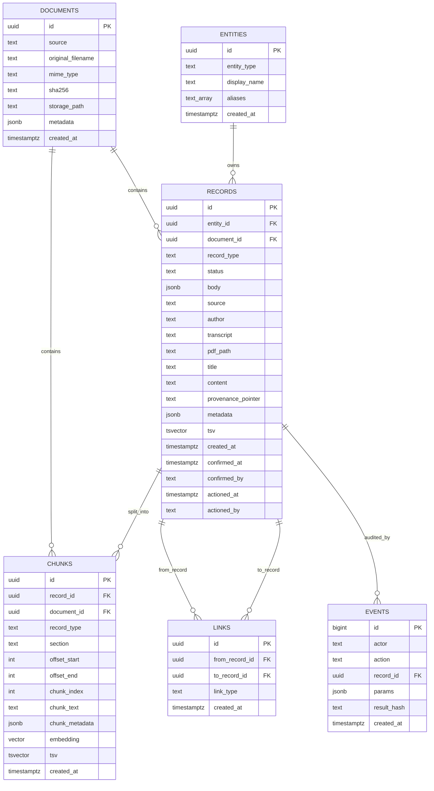
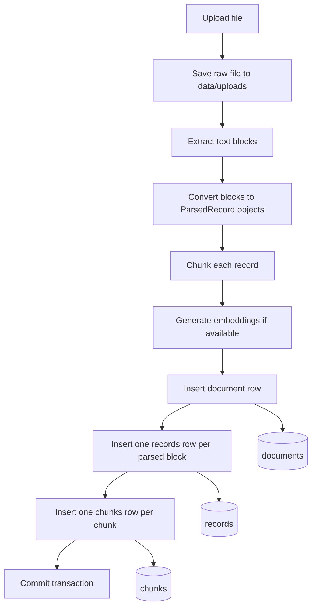
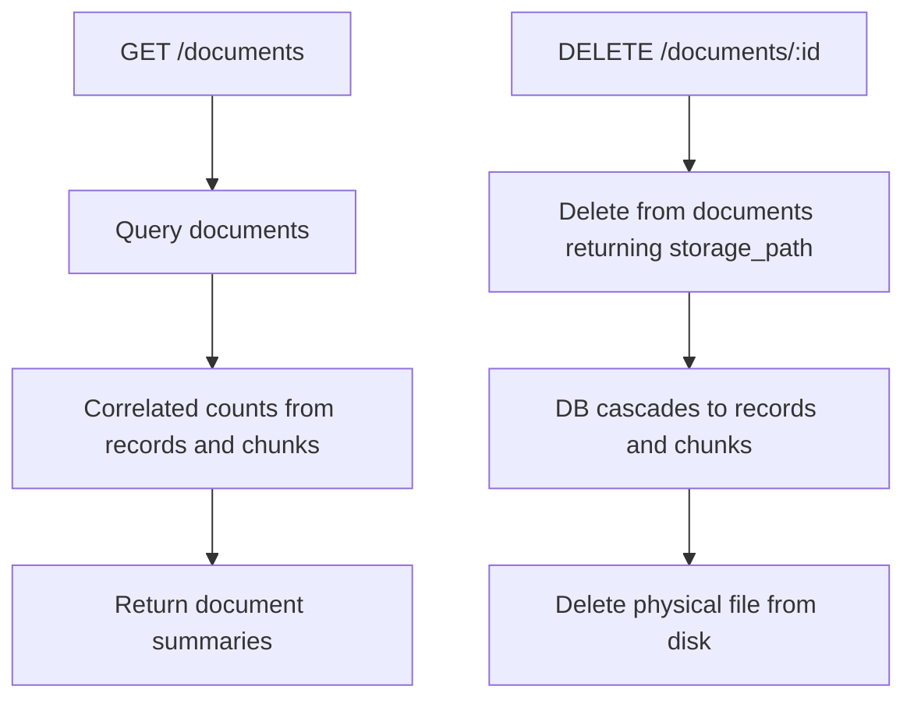
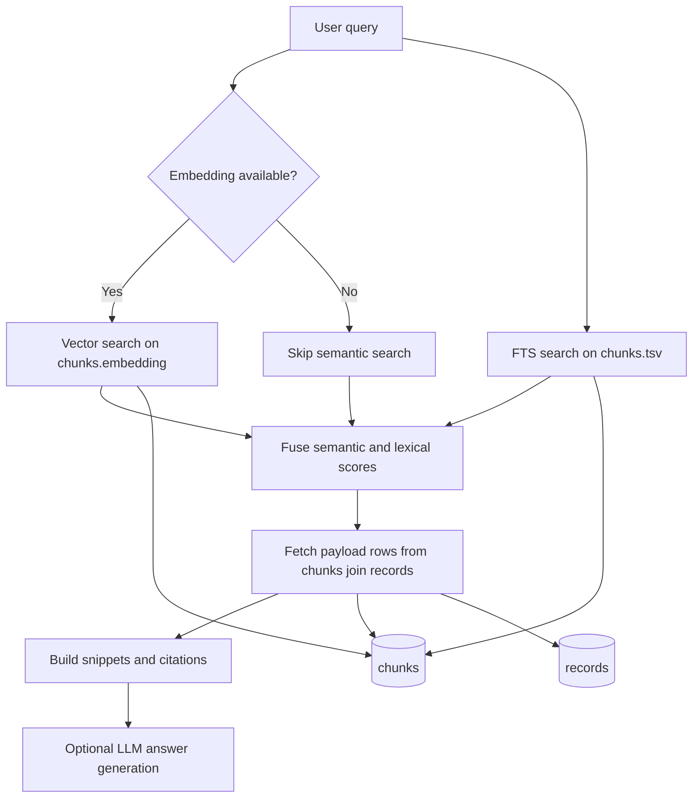
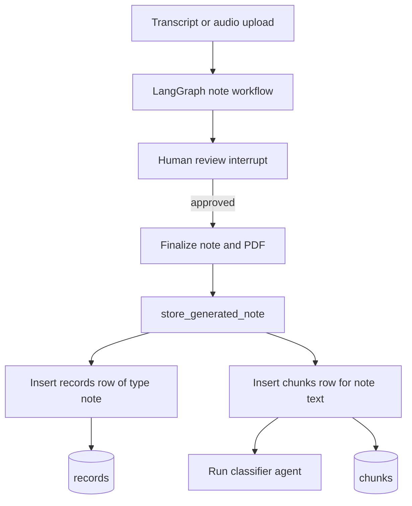
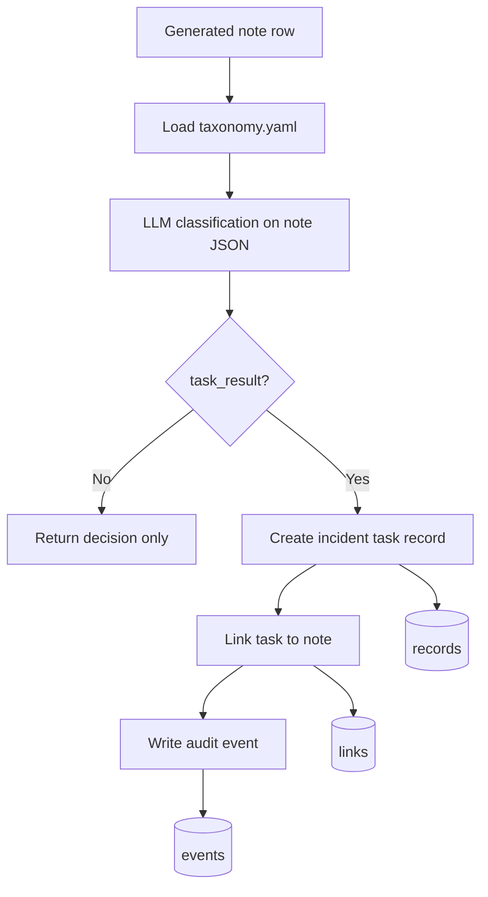
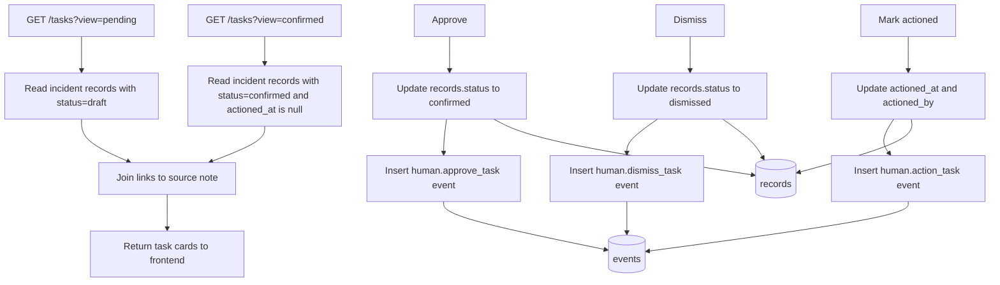
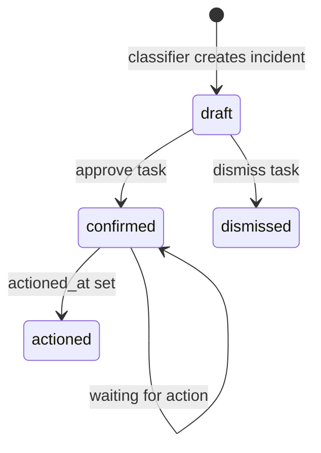
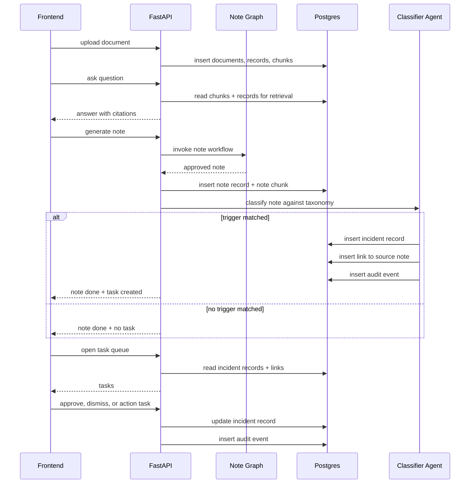

# Database Flow

This document maps how the `agents` app uses Postgres across ingestion, retrieval, note generation, trigger classification, and task review.

Primary schema source: `agents/spine_schema.sql`

Primary code paths:
- `agents/src/rag/db.py`
- `agents/src/rag/service.py`
- `agents/src/api/app.py`
- `agents/src/agent/graph.py`
- `agents/src/agent/classiferAgent.py`

## Overview

## Core Tables

## What Each Table Stores

- `documents`: one row per uploaded source file.
- `records`: the main normalized content table. This stores both ingested document records and generated operational records such as notes and incident tasks.
- `chunks`: retrieval units for search and RAG. Each chunk belongs to a record and optionally to a document.
- `links`: explicit relationships between records. Currently used to link a generated incident task back to the source note via `triggered_by`.
- `events`: append-only audit trail for task decisions and user actions.
- `entities`: present in schema but not actively populated by the current code paths.

## Write Flow 1: Document Ingestion

Code path:
- API: `POST /documents` and `POST /ingest/file`
- Function: `ingest_upload()` in `agents/src/rag/service.py`

### Ingest Writes

- `documents`
  - `source`
  - `original_filename`
  - `mime_type`
  - `sha256`
  - `storage_path`
  - `metadata.doc_type`
- `records`
  - `document_id`
  - `record_type`
  - `status = confirmed`
  - `body` with title/content/section/provenance
  - `source`
  - `author`
  - `title`
  - `content`
  - `provenance_pointer`
  - `metadata.doc_type`
  - `metadata.ingest_source = upload`
  - `tsv`
- `chunks`
  - `record_id`
  - `document_id`
  - `record_type`
  - offsets and section metadata
  - `chunk_text`
  - `chunk_metadata.source`
  - `embedding` when available
  - `tsv`

## Read Flow 1: Document Listing and Deletion

Code path:
- `GET /documents` -> `list_documents()`
- `DELETE /documents/{document_id}` -> `delete_document()`

Notes:
- Deleting a `documents` row cascades to child `records` and `chunks` because of foreign keys.
- No application-level delete is needed for those child rows.

## Read Flow 2: Retrieval and Chat

Code path:
- `POST /retrieve` -> `retrieve_chunks()`
- `POST /chat` and `POST /agent/answer` -> `answer_question()` -> `retrieve_chunks()`

### Retrieval Reads

- Search candidates come from `chunks`.
- Citation metadata is completed by joining `chunks.record_id -> records.id`.
- `record_type`, `source`, and `candidate_chunk_ids` are used as optional filters.

## Write Flow 2: Note Generation

Code path:
- `POST /generate/text`
- `POST /generate/audio`
- `POST /generate/resume`
- Final persistence: `store_generated_note()` in `agents/src/rag/service.py`

### Generated Note Writes

- `records`
  - `record_type = note`
  - `status = confirmed`
  - `body = full structured note JSON`
  - `source = thread:<thread_id>`
  - `author = support_worker`
  - `title = Generated NDIS progress note`
  - `content = flattened note text`
  - `metadata.origin = note_generator`
  - `metadata.thread_id`
  - `tsv`
- `chunks`
  - one chunk covering the flattened generated note text
  - `section = generated_note`
  - optional `embedding`

## Write Flow 3: Classifier Agent and Task Creation

Code path:
- Triggered from `build_done_response()` in `agents/src/api/app.py`
- Executed by `run_agent2()` in `agents/src/agent/classiferAgent.py`
- Taxonomy source: `agents/src/agent/taxonomy.yaml`

### Classifier Writes

If the classifier matches a trigger:

- `records`
  - `record_type = incident`
  - `status = draft`
  - `author = a2_agent`
  - `source = a2:<source_note_record_id>`
  - `body.trigger_id`
  - `body.reasoning`
  - `body.workflow`
  - `body.deadline`
- `links`
  - `from_record_id = incident task`
  - `to_record_id = source note`
  - `link_type = triggered_by`
- `events`
  - `actor = a2_agent`
  - `action = a2.trigger_matched`
  - `params.trigger_id`

If the classifier does not match:

- no DB writes occur in the classifier path
- only the in-memory decision is returned to the API response

## Read and Write Flow 4: Task Queue

Code path:
- `GET /tasks`
- `POST /tasks/{task_id}/approve`
- `POST /tasks/{task_id}/dismiss`
- `POST /tasks/{task_id}/action`

### Task State Model

Implementation detail:
- `actioned` is not a separate `status` value.
- A task is considered actioned when `status = confirmed` and `actioned_at IS NOT NULL`.

## Record Types in Practice

The `records` table is polymorphic. Current code paths store at least these logical record types:

- ingested document-derived records: values inferred by `classify_record_type()` during ingestion
- generated support notes: `record_type = note`
- classifier-created tasks: `record_type = incident`

This makes `records` the hub of the app.

## End-to-End Operational Flow

## Non-Application Tables

`agents/src/agent/graph.py` configures a LangGraph `PostgresSaver` checkpointer.

That means the same Postgres database also stores LangGraph checkpoint tables managed by LangGraph itself. Those tables are not defined in `spine_schema.sql`, but they are part of the runtime DB footprint for note generation and resume flows.

## Practical Summary

- `documents` is the file registry.
- `records` is the source-of-truth content and task table.
- `chunks` powers retrieval.
- `links` ties classifier-created incidents back to notes.
- `events` provides an audit trail for classifier and human actions.
- Note generation and task generation are separate stages, but both persist through `records`.
