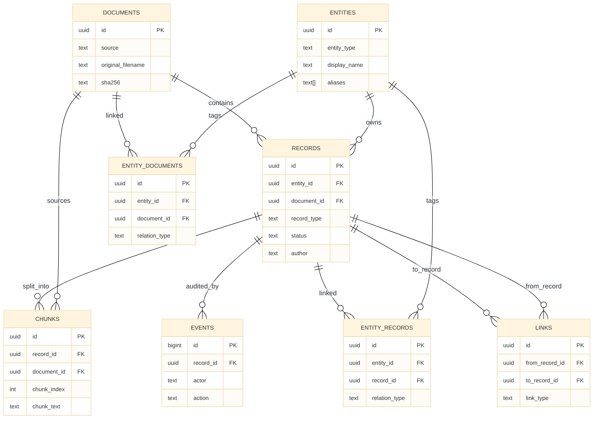

## Printable Database Diagram

Best printed on a single A4 page in landscape orientation.

```mermaid
%%{init: {"theme": "base", "themeVariables": {"fontSize": "12px"}}}%%
erDiagram
    ENTITIES ||--o{ RECORDS : owns
    ENTITIES ||--o{ ENTITY_DOCUMENTS : tags
    ENTITIES ||--o{ ENTITY_RECORDS : tags
    DOCUMENTS ||--o{ RECORDS : contains
    DOCUMENTS ||--o{ CHUNKS : sources
    DOCUMENTS ||--o{ ENTITY_DOCUMENTS : linked
    RECORDS ||--o{ CHUNKS : split_into
    RECORDS ||--o{ ENTITY_RECORDS : linked
    RECORDS ||--o{ EVENTS : audited_by
    RECORDS ||--o{ LINKS : from_record
    RECORDS ||--o{ LINKS : to_record

    ENTITIES {
        uuid id PK
        text entity_type
        text display_name
        text[] aliases
    }

    DOCUMENTS {
        uuid id PK
        text source
        text original_filename
        text sha256
    }

    RECORDS {
        uuid id PK
        uuid entity_id FK
        uuid document_id FK
        text record_type
        text status
        text author
    }

    CHUNKS {
        uuid id PK
        uuid record_id FK
        uuid document_id FK
        int chunk_index
        text chunk_text
    }

    ENTITY_DOCUMENTS {
        uuid id PK
        uuid entity_id FK
        uuid document_id FK
        text relation_type
    }

    ENTITY_RECORDS {
        uuid id PK
        uuid entity_id FK
        uuid record_id FK
        text relation_type
    }

    LINKS {
        uuid id PK
        uuid from_record_id FK
        uuid to_record_id FK
        text link_type
    }

    EVENTS {
        bigint id PK
        uuid record_id FK
        text actor
        text action
    }
```
