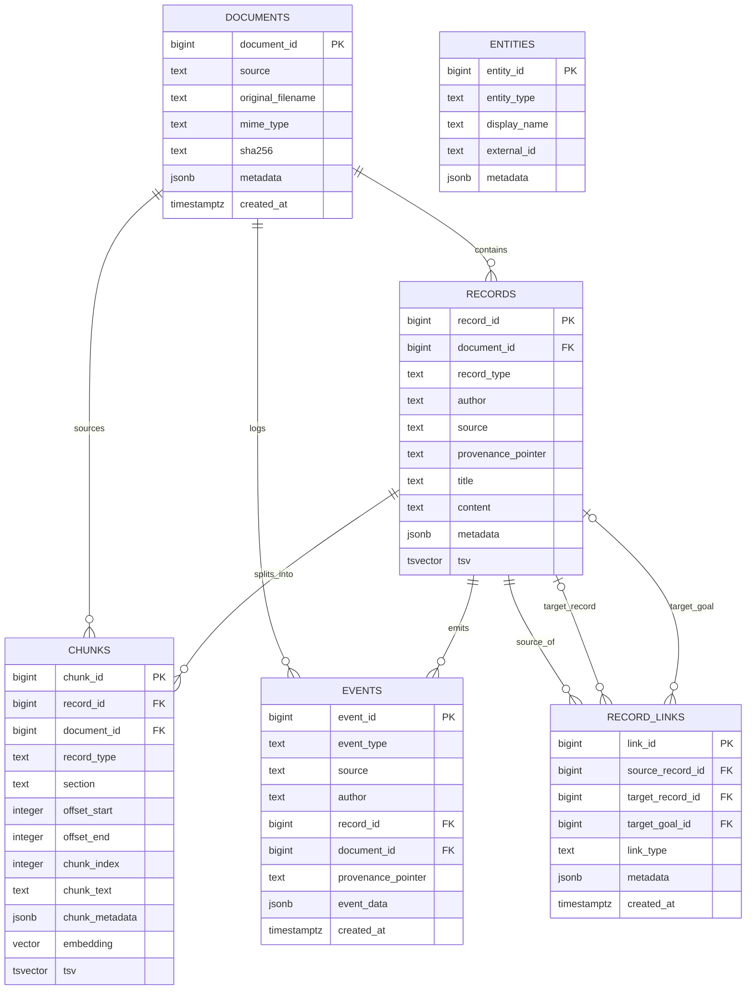
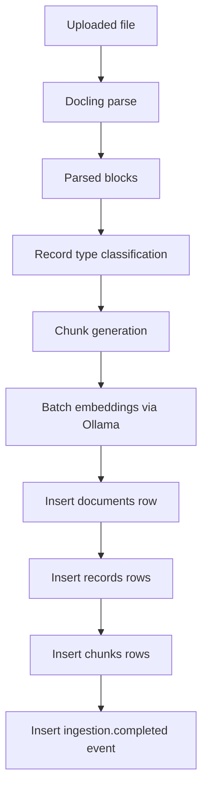
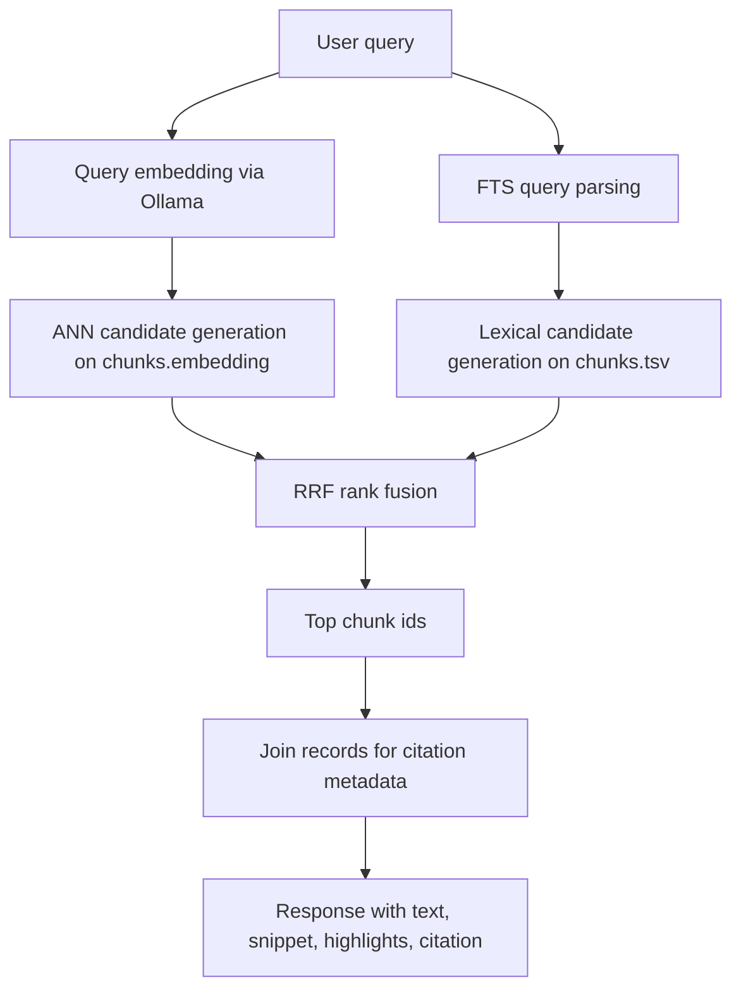

# Database Flow

This document summarizes how data moves through Postgres and pgvector in the application.

## Overview

The database stores documents, records, chunks, and events.

Chunks are the main retrieval unit. Each chunk stores:

- source and citation metadata
- a full-text search vector (`tsv`)
- a fixed-dimension embedding (`vector(EMBEDDING_DIM)`)

Retrieval runs against `chunks`, then joins back to `records` to return citation details.

## Main Tables

- `documents`
  - one row per uploaded file
- `records`
  - structured units extracted from a document
- `chunks`
  - retrieval units derived from records
- `events`
  - append-only ingestion and audit events
- `record_links`
  - relationship table for linking records
- `entities`
  - reserved for person and organization modeling

## ER Diagram

## Ingestion Flow

## Retrieval Flow

## Indexing

- `chunks.tsv` uses a GIN index for lexical search
- `chunks.embedding` uses an HNSW index with cosine distance for semantic search
- standard B-tree indexes are used on document, record, and filter columns

## Notes

- `chunks` is the retrieval surface for both semantic and lexical search.
- `records` stores source context and is joined after ranking to build citations.
- `events` provides traceability for ingestion operations.
- `entities` and `record_links` are present in the schema for broader modeling, but are not populated by the current ingestion path.
